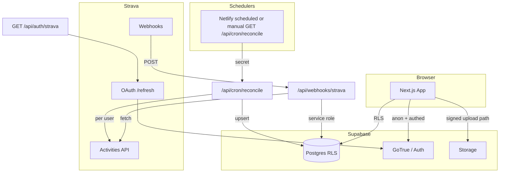

# Fundraising Challenge Tracker — architecture

## Overview

- **Next.js 16 (App Router)** on **Netlify** (or any Node host): UI, route handlers, server actions.
- **Supabase (Postgres + Auth + Storage)**: data, RLS, participant and admin users, public assets.
- **Strava API**: OAuth for participants, webhooks for activity `create`/`update`, refresh tokens, scheduled backfill to reconcile missed webhooks.
- **Justgiving** (optional): feature-flagged adapter; UI and DB fields exist but core flows do not require it.

## High-level flow

## Sequence: participant sign-in (Strava)

1. User hits `/api/auth/strava/start` → redirect to Strava authorize (or mock).
2. Strava calls `/api/auth/strava/callback?code&state` → state cookie verified.
3. Code exchanged for access/refresh + athlete; service role `createUser` / `updateUser` with **synthetic email** `strava+{id}@domain` and **HMAC-derived password** (server secret); session established via `signInWithPassword`.
4. `public.users`, `athlete_profiles`, `strava_connections` upserted.

**Admin** uses Supabase email/password or magic link with `app_metadata.role = 'admin'`.

## Activity pipeline

1. **Webhook** or **cron** loads activity → `activities` upsert.
2. For each **joined campaign**, compute **eligibility** (type + window) in `domain/`.
3. **Moderation** row: `initialModerationStatus` from campaign `review_mode` unless a non-pending **manual** state already exists.
4. `activity_campaign_matches` stores per-objective “included” metrics for approved rows.
5. `recomputeLeaderboard` aggregates matches + approved reviews, writes `leaderboards_cache` and `campaign_participants.rank_cached` / `cached_score`.

## Optional JustGiving

- `JUSTGIVING_ENABLED` + `JUSTGIVING_API_KEY` → adapter can fetch page totals; UI hidden when disabled.

## Storage (unified media)

- Buckets: `athlete-avatars`, `admin-avatars`, `campaign-images`.
- `POST /api/upload/media` (JSON) issues signed upload using service role; client PUTs the file, then you persist `*_path` on profile/campaign. Same pattern for all three scopes with different validation rules.

## Security

- **RLS** on all public tables; **no** strava token policies (service role only in API).
- **Never** use `user_metadata` for role checks; `app_metadata.role` for admin.
- **Webhook idempotency** via `webhook_events.idempotency_key` unique.
- **Cron** and sensitive jobs gated by `CRON_SECRET` query param.

See `../supabase/migrations/20260424120000_initial_schema.sql` for the full RLS design.
